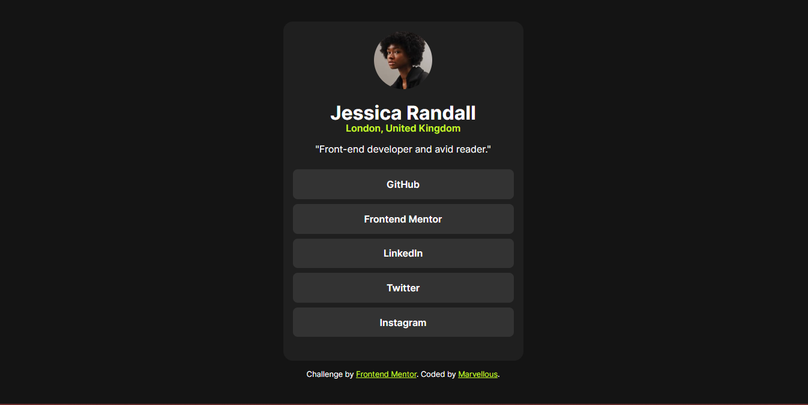

# Frontend Mentor - Social links profile solution

This is a solution to the [Social links profile challenge on Frontend Mentor](https://www.frontendmentor.io/challenges/social-links-profile-UG32l9m6dQ). Frontend Mentor challenges help you improve your coding skills by building realistic projects. 

## Table of contents

- [Overview](#overview)
  - [The challenge](#the-challenge)
  - [Screenshot](#screenshot)
  - [Links](#links)
- [My process](#my-process)
  - [Built with](#built-with)
  - [What I learned](#what-i-learned)
  - [Continued development](#continued-development)
- [Author](#author)

## Overview

### The challenge

Users should be able to:

- See hover and focus states for all interactive elements on the page

### Screenshot



### Links

- Github URL: [social-links-fem](https://github.com/Marvie-03/social-links-fem)
- Live Site URL: [Add live site URL here](https://your-live-site-url.com)

## My process

### Built with

- Semantic HTML5 markup
- CSS custom properties
- Flexbox
- Media queries


### What I learned

The mobile view wasn't responsive. I had to use media query.
```css
@media screen and (max-width: 600px) {
    footer{
        display: none;
    }
    .card{
        max-width: 20rem;
    }
}
```


### Continued development

I'll make a social link profile for myself


## Author

- Website - [Marvie](https://www.your-site.com)
- Frontend Mentor - [@Marvie-03](https://www.frontendmentor.io/profile/Marvie-03)
- Twitter - [@kayveengee](https://www.twitter.com/kayveengee)


